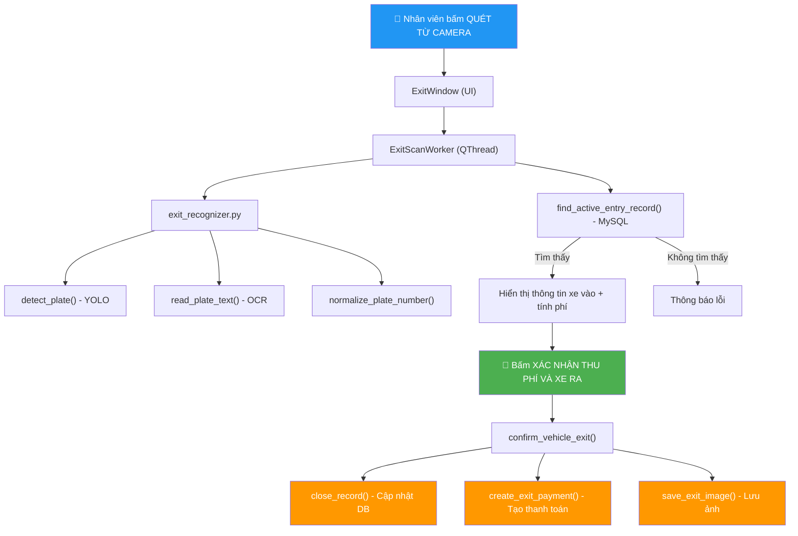
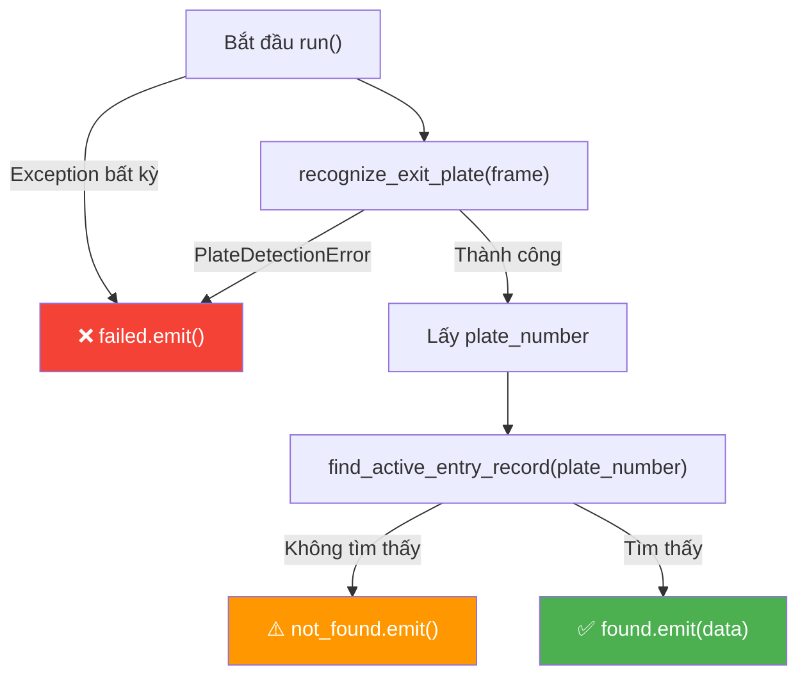
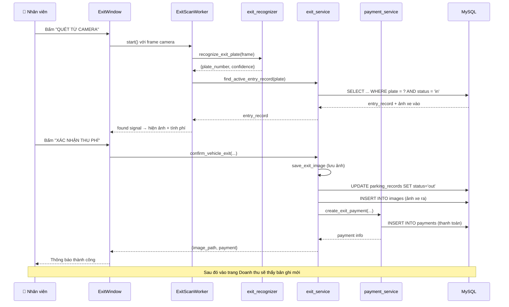

# Giải Thích Code: Quét Xe Ra & Doanh Thu

---

## Tổng Quan Kiến Trúc



---

# PHẦN 1: QUÉT XE RA

## 1. [exit_window.py](file:///a:/PYTHON!/ui/exit_window.py) — Giao diện chính

### Khởi tạo (`__init__`, dòng 35-48)

```python
def __init__(self, user: dict | None = None, parent=None):
    super().__init__(parent)
    self.user = user or {}                # Thông tin nhân viên đang đăng nhập
    self.setObjectName("ExitWindow")
    self.setStyleSheet(_load_exit_style()) # Load CSS từ file exit.css

    self.exit_entry_record = None   # Bản ghi xe vào (từ DB) để đối chiếu
    self.exit_capture_path = None   # Đường dẫn ảnh chụp xe ra
    self.current_frame = None       # Frame hiện tại từ camera
    self.exit_confidence = None     # Độ tin cậy OCR
    self.exit_scan_worker = None    # Worker thread quét biển số
    self.exit_fee = None            # Phí gửi xe đã tính

    self._build_ui()
```

**Giải thích:**
- `user`: dict chứa thông tin nhân viên (id, tên...) — dùng để ghi nhận ai thu phí
- Các biến `self.*` là **trạng thái** của cửa sổ, được reset sau mỗi lần xác nhận xe ra
- `vehicle_exited = pyqtSignal()` (dòng 33): Signal phát ra khi xe ra thành công → các cửa sổ khác (dashboard) có thể lắng nghe để cập nhật

---

### Xây dựng giao diện (`_build_ui`, dòng 50-132)

Giao diện gồm **5 phần** từ trên xuống:

| Thứ tự | Phần tử | Mô tả |
|--------|---------|-------|
| 1 | `QLabel("QUET BIEN SO XE RA")` | Tiêu đề trang |
| 2 | 2 card cạnh nhau (`QHBoxLayout`) | **Trái**: Camera xe ra (live feed). **Phải**: Ảnh xe lúc vào (lấy từ DB) |
| 3 | `QPushButton("QUET TU CAMERA")` | Nút bấm quét biển số |
| 4 | `info_frame` (QGridLayout) | Hiển thị: biển số, trạng thái, phí gửi xe |
| 5 | `QPushButton("XAC NHAN THU PHI VA XE RA")` | Nút xác nhận thu phí (mặc định **disabled**) |

```
┌──────────────────────────────────────────────┐
│           QUET BIEN SO XE RA                 │
├────────────────────┬─────────────────────────┤
│   Camera xe ra     │   Anh xe luc vao        │
│   (live feed)      │   (ảnh từ DB)           │
├────────────────────┴─────────────────────────┤
│           [ QUET TU CAMERA ]                 │
├──────────────────────────────────────────────┤
│  Biển số: 51F-123.45  │  THONG QUA - ...     │
│     Phí: 20.000 VND - 2 giờ 30 phút         │
├──────────────────────────────────────────────┤
│       [ XAC NHAN THU PHI VA XE RA ]         │
└──────────────────────────────────────────────┘
```

---

### Cập nhật camera (`update_camera_frame`, dòng 134-138)

```python
def update_camera_frame(self, frame) -> None:
    self.current_frame = frame.copy()              # Lưu frame hiện tại
    self._show_frame(frame, self.exit_camera_label) # Hiển thị lên QLabel
    if self.exit_entry_record is None:              # Chưa quét → hiện thời gian thực
        self.exit_status_label.setText(datetime.now().strftime("%d/%m/%Y %H:%M:%S"))
```

**Giải thích:** Hàm này được gọi liên tục từ bên ngoài (camera thread) mỗi khi có frame mới. Nó:
1. Lưu lại frame để khi bấm quét sẽ dùng frame này
2. Hiển thị live feed lên card bên trái
3. Nếu chưa quét biển số → hiển thị đồng hồ thời gian thực

---

### Quét biển số (`scan_exit_plate`, dòng 140-162)

```python
def scan_exit_plate(self) -> None:
    # Kiểm tra: đã có frame từ camera chưa?
    if self.current_frame is None:
        QMessageBox.warning(self, "Camera", "Chua co hinh anh tu camera quet xe ra.")
        return

    # Kiểm tra: worker trước đó đang chạy thì bỏ qua (tránh quét chồng)
    if self.exit_scan_worker is not None and self.exit_scan_worker.isRunning():
        return

    # Reset UI về trạng thái "đang quét"
    self.scan_exit_btn.setEnabled(False)
    self.confirm_exit_btn.setEnabled(False)
    self.exit_status_label.setText("DANG QUET BIEN SO XE RA...")
    self.exit_plate_label.setText("--")
    self.exit_fee_label.setText("Phi gui xe: --")
    self.exit_fee = None
    self.entry_image_label.setPixmap(QPixmap())
    self.entry_image_label.setText("Dang tim anh xe luc vao...")

    # Tạo worker thread mới để quét (không block UI)
    self.exit_scan_worker = ExitScanWorker(self.current_frame)
    self.exit_scan_worker.found.connect(self._on_exit_scan_found)         # Tìm thấy xe
    self.exit_scan_worker.not_found.connect(self._on_exit_scan_not_found) # Không tìm thấy
    self.exit_scan_worker.failed.connect(self._on_exit_scan_failed)       # Lỗi OCR
    self.exit_scan_worker.finished.connect(self._on_exit_scan_finished)   # Hoàn tất
    self.exit_scan_worker.start()
```

> [!IMPORTANT]
> Việc quét chạy trên **QThread riêng** (ExitScanWorker) để không làm đơ giao diện. Kết quả trả về qua **signal/slot** của PyQt5.

---

### Xử lý kết quả quét

#### Tìm thấy xe trong bãi (`_on_exit_scan_found`, dòng 164-168)

```python
def _on_exit_scan_found(self, data: dict) -> None:
    plate_number = data["plate_number"]           # Biển số đọc được
    self.exit_confidence = data.get("confidence")  # Độ tin cậy OCR
    self.exit_entry_record = data.get("entry_record")  # Bản ghi xe vào từ DB
    self._show_entry_record(plate_number, self.exit_entry_record)  # Hiển thị
```

#### Không tìm thấy xe (`_on_exit_scan_not_found`, dòng 170-178)

Hiển thị cảnh báo "KHONG THONG QUA", disable nút xác nhận.

#### Quét thất bại (`_on_exit_scan_failed`, dòng 180-186)

Hiển thị "QUET THAT BAI" — lỗi có thể do không nhận diện được biển số, biển mờ, v.v.

---

### Hiển thị thông tin xe vào (`_show_entry_record`, dòng 191-230)

```python
def _show_entry_record(self, plate_number: str, entry_record) -> None:
    self.exit_plate_label.setText(plate_number)    # Hiện biển số

    if not entry_record:                           # Không có bản ghi → không cho ra
        self.entry_image_label.setText("Khong tim thay xe dang trong bai")
        self.confirm_exit_btn.setEnabled(False)
        return

    # Hiện ảnh xe lúc vào (card bên phải)
    image_path = self.exit_entry_record.get("image_path")
    if image_path and os.path.exists(image_path):
        pixmap = QPixmap(image_path)
        self.entry_image_label.setPixmap(pixmap.scaled(...))

    # Hiện trạng thái: "THONG QUA - Vao luc: ... - Khu: ... - OCR: ...%"
    entry_time = self.exit_entry_record.get("entry_time")
    status = f"THONG QUA - Vao luc: {entry_time}"
    ...

    # ⭐ TÍNH PHÍ GỬI XE
    self.exit_fee = calculate_parking_fee(self.exit_entry_record)
    self.exit_fee_label.setText(
        f"Thoi gian gui: {format_duration(self.exit_fee['duration_minutes'])} - "
        f"Phi: {format_money(self.exit_fee['amount'])}"
    )
    self.confirm_exit_btn.setEnabled(True)  # Bật nút xác nhận
```

> [!TIP]
> Luồng so sánh rất trực quan: camera bên trái chụp xe ra, ảnh lúc vào hiện bên phải → nhân viên đối chiếu bằng mắt trước khi xác nhận.

---

### Xác nhận thu phí và xe ra (`confirm_exit_vehicle`, dòng 232-266)

```python
def confirm_exit_vehicle(self) -> None:
    # Validate
    if not self.exit_entry_record: ...  # Chưa đối chiếu
    if self.current_frame is None: ...  # Chưa có camera

    plate_number = self.exit_plate_label.text()

    # Gọi service xử lý nghiệp vụ
    result = confirm_vehicle_exit(
        self.exit_entry_record,      # Bản ghi xe vào
        plate_number,                # Biển số
        self.current_frame,          # Frame camera hiện tại (để lưu ảnh)
        self.exit_confidence,        # Độ tin cậy OCR
        paid_by=self.user.get("id"), # Nhân viên thu phí
    )
    self.exit_capture_path = result.get("image_path")  # Ảnh xe ra đã lưu
    payment = result.get("payment") or {}               # Thông tin thanh toán

    # Cập nhật UI
    self.exit_status_label.setText("DA XAC NHAN THU PHI VA XE RA")
    self.exit_fee_label.setText(f"Da thu: {format_money(...)}")
    self.confirm_exit_btn.setEnabled(False)

    # Reset trạng thái
    self.exit_entry_record = None
    self.exit_confidence = None
    self.exit_fee = None

    # Phát signal → dashboard cập nhật
    self.vehicle_exited.emit()

    # Thông báo thành công
    QMessageBox.information(self, "Thanh cong", f"Da xac nhan xe ra va thu phi ...")
```

---

## 2. [exit_scan_worker.py](file:///a:/PYTHON!/ui/exit_scan_worker.py) — Worker Thread

```python
class ExitScanWorker(QThread):
    found = pyqtSignal(dict)       # Tìm thấy xe trong bãi
    not_found = pyqtSignal(str, str)  # Biển số hợp lệ nhưng xe không trong bãi
    failed = pyqtSignal(str)       # Lỗi nhận diện
```

### Luồng chạy (`run`, dòng 17-39)



**Giải thích:** Worker thực hiện 2 bước chính:
1. **Nhận diện biển số** → gọi `recognize_exit_plate(frame)`
2. **Tra cứu DB** → gọi `find_active_entry_record(plate_number)` để kiểm tra xe có đang trong bãi không

Kết quả trả về qua 3 signal tương ứng 3 trường hợp.

---

## 3. [exit_recognizer.py](file:///a:/PYTHON!/recognition/exit_recognizer.py) — Nhận diện biển số

```python
def recognize_exit_plate(frame_bgr) -> dict:
    # Bước 1: Phát hiện vùng biển số trong ảnh (YOLO)
    plate_image, detect_confidence = detect_plate(frame_bgr)

    # Bước 2: Đọc text từ ảnh biển số (OCR - EasyOCR/PaddleOCR)
    plate_text, ocr_confidence = read_plate_text(plate_image)

    # Bước 3: Chuẩn hóa (xóa khoảng trắng, sửa ký tự nhầm...)
    plate_number = normalize_plate_number(plate_text)

    # Debug log
    print(f"[DEBUG] EXIT OCR raw='{plate_text}' | normalized='{plate_number}' | ...")

    # Bước 4: Validate định dạng biển số Việt Nam
    if not is_valid_plate_number(plate_number):
        raise ValueError("OCR doc duoc nhung khong dung dinh dang...")

    return {
        "plate_number": plate_number,
        "confidence": ocr_confidence or detect_confidence,
    }
```

**Pipeline nhận diện:**
```
Frame camera → [YOLO detect] → Crop vùng biển số → [OCR đọc text]
    → Chuẩn hóa → Validate định dạng → Trả về biển số + confidence
```

---

## 4. [exit_service.py](file:///a:/PYTHON!/services/exit_service.py) — Nghiệp vụ xe ra

### Tìm xe đang trong bãi (`find_active_entry_record`, dòng 15-39)

```sql
SELECT pr.id, pr.entry_time, v.plate_number, v.vehicle_type,
       z.zone_name, img.image_path
FROM parking_records pr
JOIN vehicle v ON v.id = pr.vehicle_id
LEFT JOIN parking_zones z ON z.id = pr.zone_id
LEFT JOIN images img ON img.parking_record_id = pr.id AND img.image_type = 'entry'
WHERE v.plate_number = %s        -- Tìm theo biển số
  AND pr.exit_time IS NULL       -- Chưa ra (chưa có exit_time)
  AND pr.status = 'in'           -- Trạng thái đang trong bãi
ORDER BY pr.entry_time DESC      -- Lấy lần vào gần nhất
LIMIT 1
```

**Giải thích:** Query này JOIN 4 bảng:
- `parking_records` (pr): bản ghi gửi xe
- `vehicle` (v): thông tin xe
- `parking_zones` (z): khu vực đỗ
- `images` (img): ảnh chụp lúc vào

Điều kiện: `exit_time IS NULL` và `status = 'in'` → chỉ lấy xe **đang trong bãi**.

---

### Xác nhận xe ra (`confirm_vehicle_exit`, dòng 42-59)

```python
def confirm_vehicle_exit(entry_record, plate_number, frame_bgr, confidence, paid_by):
    record_id = entry_record.get("parking_record_id")

    # 1. Lưu ảnh xe ra vào thư mục storage/exit_images/
    image_path = save_exit_image(frame_bgr, plate_number)

    # 2. Đóng bản ghi: SET exit_time = NOW(), status = 'out'
    close_record(record_id)

    # 3. Lưu ảnh vào bảng images (type = 'exit')
    create_image(record_id, image_path, "exit", plate_number, confidence)

    # 4. Tạo thanh toán (tính phí + INSERT vào bảng payments)
    payment = create_exit_payment(entry_record, paid_by=paid_by)

    return {"image_path": image_path, "payment": payment}
```

> [!IMPORTANT]
> Hàm này thực hiện **4 hành động quan trọng** trong 1 lần gọi:
> 1. Lưu ảnh xe ra lên ổ đĩa
> 2. Cập nhật `parking_records` → đánh dấu xe đã ra
> 3. Ghi ảnh vào DB (bảng `images`)
> 4. Tạo bản ghi thanh toán (bảng `payments`)

### Lưu ảnh xe ra (`save_exit_image`, dòng 62-67)

```python
def save_exit_image(frame_bgr, plate_number: str) -> str:
    EXIT_IMAGE_DIR.mkdir(parents=True, exist_ok=True)  # Tạo thư mục nếu chưa có
    timestamp = datetime.now().strftime("%Y%m%d_%H%M%S")
    image_path = EXIT_IMAGE_DIR / f"{plate_number}_{timestamp}.jpg"  # VD: 51F12345_20260620_215900.jpg
    cv2.imwrite(str(image_path), frame_bgr)
    return str(image_path)
```

---

## 5. [parking_record_model.py](file:///a:/PYTHON!/models/parking_record_model.py) — Model bản ghi

### Đóng bản ghi (`close_record`, dòng 28-38)

```python
def close_record(record_id: int) -> None:
    execute("""
        UPDATE parking_records
        SET exit_time = CURRENT_TIMESTAMP, status = 'out'
        WHERE id = %s
    """, (record_id,))
```

**Giải thích:** Cập nhật `exit_time` = thời gian hiện tại và `status` = `'out'` → xe đã ra khỏi bãi.

---

## 6. [payment_service.py](file:///a:/PYTHON!/services/payment_service.py) — Tính phí gửi xe

### Tính phí (`calculate_parking_fee`, dòng 11-41)

```python
def calculate_parking_fee(entry_record, exit_time=None):
    exit_time = exit_time or datetime.now()
    entry_time = _as_datetime(entry_record.get("entry_time"))
    vehicle_type = entry_record.get("vehicle_type") or "car"

    # Tính thời gian gửi (phút), tối thiểu 1 phút
    duration_minutes = max(1, math.ceil((exit_time - entry_time).total_seconds() / 60))

    # Lấy biểu giá từ DB (bảng fee_rules), fallback về mặc định
    rule = _get_active_fee_rule(vehicle_type) or _get_active_fee_rule("car") or _default_rule()

    first_minutes = int(rule.get("first_block_minutes") or 60)   # VD: 60 phút đầu
    first_price = _to_float(rule.get("first_block_price"))        # VD: 20,000 VND
    next_hour_price = _to_float(rule.get("next_hour_price"))      # VD: 10,000 VND/giờ tiếp
    daily_max_price = rule.get("daily_max_price")                  # VD: 150,000 VND/ngày

    # Tính phí
    if duration_minutes <= first_minutes:
        amount = first_price                     # Trong block đầu → giá cố định
    else:
        extra_minutes = duration_minutes - first_minutes
        extra_hours = math.ceil(extra_minutes / 60)   # Làm tròn lên
        amount = first_price + extra_hours * next_hour_price

    # Áp mức trần nếu có
    if daily_max_price is not None:
        amount = min(amount, _to_float(daily_max_price))

    return {"amount": float(amount), "duration_minutes": duration_minutes, ...}
```

**Ví dụ tính phí (xe ô tô, biểu giá mặc định):**

| Thời gian gửi | Cách tính | Phí |
|---------------|-----------|-----|
| 30 phút | ≤ 60 phút → first_block | 20,000 VND |
| 1 giờ 30 phút | 20,000 + ceil(30/60) × 10,000 | 30,000 VND |
| 3 giờ | 20,000 + ceil(120/60) × 10,000 | 40,000 VND |
| 24 giờ | Tính ra 250,000 nhưng max 150,000 | 150,000 VND |

### Biểu giá mặc định (`_default_rule`, dòng 104-111)

```python
def _default_rule():
    return {
        "vehicle_type": "car",
        "first_block_minutes": 60,      # 60 phút đầu
        "first_block_price": 20000,      # 20,000 VND
        "next_hour_price": 10000,        # 10,000 VND/giờ tiếp
        "daily_max_price": 150000,       # Tối đa 150,000 VND/ngày
    }
```

### Tạo thanh toán (`create_exit_payment`, dòng 44-60)

```python
def create_exit_payment(entry_record, paid_by=None, payment_method="cash"):
    fee = calculate_parking_fee(entry_record)        # Tính phí
    payment_id = create_payment(                      # INSERT vào bảng payments
        parking_record_id=...,
        amount=fee["amount"],
        duration_minutes=fee["duration_minutes"],
        payment_method=payment_method,
        status="paid",
        paid_by=paid_by,                              # ID nhân viên thu phí
    )
    fee["payment_id"] = payment_id
    return fee
```

### Tiện ích format

```python
def format_money(amount: float) -> str:
    return f"{amount:,.0f} VND".replace(",", ".")
    # 20000 → "20.000 VND"

def format_duration(minutes: int) -> str:
    # 150 → "2 gio 30 phut"
    # 60  → "1 gio"
    # 45  → "45 phut"
```

---

---

# PHẦN 2: DOANH THU

## 1. [revenue_window.py](file:///a:/PYTHON!/ui/revenue_window.py) — Giao diện báo cáo

### Cấu trúc giao diện (`_build_ui`, dòng 36-72)

```
┌──────────────────────────────────────────────────────────┐
│  Bao cao doanh thu                       [ Lam moi ]    │
├──────────────────────────────────────────────────────────┤
│  ┌─────────────────┐                                    │
│  │ Tong doanh thu   │                                    │
│  │ 1.250.000 VND   │                                    │
│  └─────────────────┘                                    │
├──────────────────────────────────────────────────────────┤
│  #  │ BIEN SO  │ LOAI XE │ T/G GUI │ SO TIEN │ THU NGAN │ TT │ T/G THU │
│  1  │ 51F-123  │ Xe may  │ 2 gio   │ 30.000  │ Admin   │ TM  │ 20/6    │
│  2  │ 30A-456  │ O to    │ 5 gio   │ 60.000  │ Admin   │ TM  │ 20/6    │
│  ...│          │         │         │         │         │     │         │
└──────────────────────────────────────────────────────────┘
```

**3 phần chính:**

| Phần | Widget | Mô tả |
|------|--------|-------|
| Header | `QLabel` + `QPushButton("Lam moi")` | Tiêu đề + nút refresh |
| Summary card | `QFrame("summaryCard")` | Thẻ hiển thị tổng doanh thu |
| Bảng chi tiết | `QTableWidget` (8 cột) | Lịch sử thanh toán chi tiết |

**8 cột trong bảng:**

| # | Tên cột | Dữ liệu |
|---|---------|----------|
| 0 | `#` | ID thanh toán |
| 1 | `BIEN SO` | Biển số xe (in đậm, màu xanh `#003aaf`) |
| 2 | `LOAI XE` | "Xe may" hoặc "O to" |
| 3 | `THOI GIAN GUI` | Thời gian gửi (format "X gio Y phut") |
| 4 | `SO TIEN` | Số tiền (in đậm, màu xanh lá `#06623b`) |
| 5 | `THU NGAN` | Tên nhân viên thu phí |
| 6 | `THANH TOAN` | Phương thức (mặc định "Tien mat") |
| 7 | `THOI GIAN THU` | Thời điểm thanh toán |

---

### Tải dữ liệu (`load_data`, dòng 88-120)

```python
def load_data(self):
    # 1. Lấy tổng doanh thu
    summary = get_revenue_summary()
    total_revenue = float(summary.get("total_revenue") or 0)
    self.revenue_label.value_label.setText(format_money(total_revenue))

    # 2. Lấy lịch sử thanh toán (tối đa 100 dòng)
    rows = list_payment_history()
    self.table.setRowCount(len(rows))

    for row_index, row in enumerate(rows):
        values = [
            str(row.get("id") or ""),
            str(row.get("plate_number") or ""),
            self._format_vehicle_type(row.get("vehicle_type")),
            format_duration(int(row.get("duration_minutes") or 0)),
            format_money(float(row.get("amount") or 0)),
            str(row.get("paid_by_name") or "He thong"),
            "Tien mat",
            str(row.get("paid_at") or ""),
        ]
        for col, value in enumerate(values):
            item = QTableWidgetItem(value)
            item.setTextAlignment(Qt.AlignCenter)
            # Cột biển số → xanh dương, đậm
            if col == 1:
                item.setForeground(QColor("#003aaf"))
                font = QFont()
                font.setBold(True)
                item.setFont(font)
            # Cột số tiền → xanh lá, đậm
            elif col == 4:
                item.setForeground(QColor("#06623b"))
                ...
            self.table.setItem(row_index, col, item)
```

---

## 2. [payment_model.py](file:///a:/PYTHON!/models/payment_model.py) — Model thanh toán

### Lấy tổng doanh thu (`get_revenue_summary`, dòng 29-40)

```sql
SELECT
    COALESCE(SUM(amount), 0) AS total_revenue,      -- Tổng tiền
    COUNT(*) AS total_payments,                       -- Số lần thanh toán
    COALESCE(SUM(duration_minutes), 0) AS total_duration_minutes  -- Tổng thời gian
FROM payments
WHERE status = 'paid'   -- Chỉ tính các thanh toán đã hoàn tất
```

### Lấy lịch sử thanh toán (`list_payment_history`, dòng 43-66)

```sql
SELECT pay.id, pay.amount, pay.duration_minutes, pay.payment_method,
       pay.status, pay.paid_at,
       v.plate_number, v.vehicle_type,
       pr.entry_time, pr.exit_time,
       u.full_name AS paid_by_name     -- Tên nhân viên thu phí
FROM payments pay
JOIN parking_records pr ON pr.id = pay.parking_record_id
JOIN vehicle v ON v.id = pr.vehicle_id
LEFT JOIN user u ON u.id = pay.paid_by  -- LEFT JOIN vì có thể NULL (hệ thống tự tính)
ORDER BY pay.paid_at DESC, pay.id DESC  -- Mới nhất lên đầu
LIMIT %s                                -- Mặc định 100
```

---

## Tổng kết luồng dữ liệu


